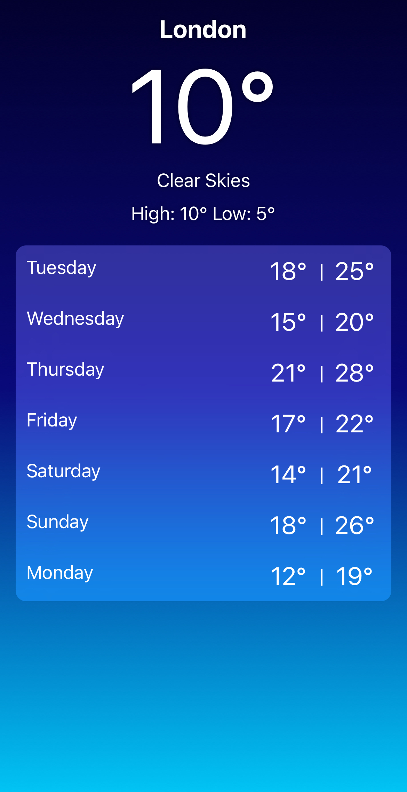

# Just Another Weather App

This is a front-end UI for a weather app challenge built with React Native, I wanted to see how much of a front end UI I could complete within 24 hours.

## Description

Just Another Weather App is a mobile application that provides users with real-time weather information. It allows users to view the current weather conditions, hourly and daily forecasts, and search for weather information of different locations.

There is no API integration at this point, all the data in the app is run on demo data.

## Features

- Current weather display: Users can view the current weather conditions including temperature, humidity, wind speed, and weather description.
- Daily forecast: Users can view the weather forecast for the next 7 days.
- Location search: Users can search for weather information of different locations by entering the city name or ZIP code.

## Demo

### Home Page:

### Weather Details Page:

## Installation

1. Clone the repository: `git clone https://github.com/your-username/just-another-weather-app.git`
2. Navigate to the project directory: `cd just-another-weather-app`
3. Install dependencies: `npm install`
4. Start the development server: `npx expo start`

## Contributing

Contributions are welcome! If you have any suggestions or improvements, feel free to open an issue or submit a pull request.

## License

This project is licensed under the [MIT License](LICENSE).
